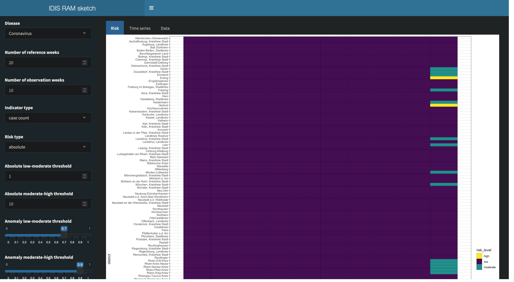
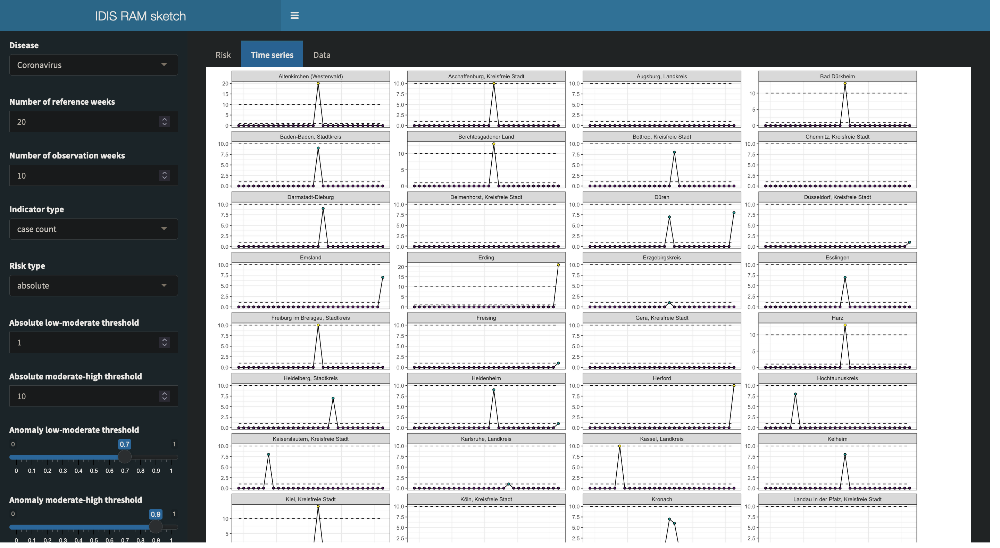
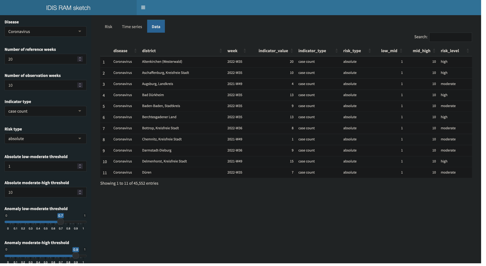

# Sketch for an IDIS risk assessment module 

An R-based, minimal webapp to compute and visualize epidemic risks based on
SOMRAS-compatible data.

## Run

To launch the webapp, run `shiny::runApp()` in this directory.

A live version is accessible here: https://stephaneghozzi.shinyapps.io/idis-ram

See [required.txt](./required.txt) for necessary packages and [session-info.txt](./session-info.txt) for an example of a working session.

## Logic

Based on generated, synthetic data that can be readily uploaded in SORMAS, epidemic indicators and associated risk levels ("low", "moderate" or "high") are computed. Results are shown in graphics and tables. Parameters can be set dynamically: disease and indicator to display, type of risk to consider, number of reference and observation weeks (see below), risk thresholds.

There is only one disease considered: "Coronavirus" (called that way in the synthetic data).

There are three indicator types: weekly case count, weekly death count, weekly hospitalization count. 

There are two types of risk:
- "absolute": the indicator value is directly compared with thresholds given by the user: 
  - if the indicator is strictly below the "low-mid" threshold, then the risk is considered "low"
  - else if the indicator is at or above the "low-mid" threshold and strictly below the "mid-high" threshold, then the risk is considered "moderate"
  - else the risk is considered "high"
- "anomaly": a statistical model is trained on the indicator in reference weeks, and the indicator value is in the observation weeks are compared to the inferred negative-binomial statistical distribution. 

The "anomaly thresholds" are the probabilities below which risk levels are considered. Absolute thresholds on the counts are derived from those probabilities, risk levels are then computed as in the "absolute risk" case.

The observation weeks are the last weeks of the data, their number are set by the user. The reference weeks are the weeks preceding the observation weeks, their number also set by the user.

There are two plots:
- tab "Risk": Heat map of the risk levels for all districts and the observation weeks.
- tab "Time series": For each district indicators as time series, colored in function of risk level, risk thresholds indicated. Both reference and observation weeks are shown.

The tab "Data" shows the data computed in the back end as a table. They are updated when the thresholds or the number of weeks are changed.

## Screenshots







## Generate data

Based on the HZI-internal package EpiDataGen (currently private on GitHub):
```
remotes::install_github("hzi-braunschweig/epidatagen", auth_token = "<your authentification token>")
```
or
```
install.packages("path/to/EpiDataGen", repos = NULL, type = "source)
```

If it is not accessible one can use the origingal sormasdatagen package: 
```
remotes::install_gitlab("stephaneghozzi/sormasdatagen")
```

In [data-raw/generate-data.R](data-raw/generate-data.R) uncomment the line 
```
# sormas_testdata <- sormasdatagen::GenerateSORMASData()
```
and run data-raw/generate-data.R to prepare the default data set. It uses [R/ConvertForSORMAS.R](R/ConvertForSORMAS.R), copied from EpiDataGen.

Please not a few important issues below.

## Issues with the packages EpiDataGen and/or sormasdatagen

- EpiDataGen is still called "sormasdatagen" and thus overwrites the "true" one
- `SaveSORMASTestData` (and not `SaveTestData` as indicated in the README) and `Export` are not exported objects (i.e., they can't be used by user)
- `Export*` functions should have an output path as argument
- `SaveSORMASTestData`: argument `output_path` is not used
- "Coronavirus" is not a disease
- Random error when using `GenerateSORMASData`, whatever the parameters: 
```
Error in fitdistrplus::fitdist(reporting_delays, "gumbel", start = list(a = 10,  : 
  The  dgumbel  function must be defined
```
- Error when using the `Export()` function of  in path/to/package/EpiDataGen/R/ExportToSORMAS.: 
```
> Export(sormas_testdata)
Error in data.frame(disease = c("CaseData", pers$disease), externalID = c("CaseData",  : 
  arguments imply differing number of rows: 1, 1121, 2
In addition: Warning messages:
1: Unknown or uninitialised column: `disease`. 
2: Unknown or uninitialised column: `causeOfDeath`. 
3: Unknown or uninitialised column: `causeOfDeathDisease`. 
4: Unknown or uninitialised column: `outcome`. 
```
The fields in questions don't appear in the generated data.

